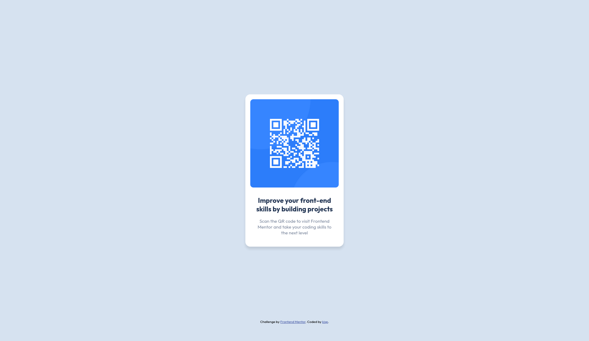

# Frontend Mentor - QR code component solution

This is a solution to the [QR code component challenge on Frontend Mentor](https://www.frontendmentor.io/challenges/qr-code-component-iux_sIO_H). Frontend Mentor challenges help you improve your coding skills by building realistic projects.

<!-- markdown-toc start - Don't edit this section. Run M-x markdown-toc-refresh-toc -->
**Table of Contents**

- [Overview](#overview)
    - [Screenshot](#screenshot)
    - [Links](#links)
- [My process](#my-process)
    - [Built with](#built-with)
    - [What I learned](#what-i-learned)

<!-- markdown-toc end -->

## Overview

### Screenshot

### Links

- Solution URL: [https://github.com/kisp/frontend-mentor-challenge-solutions/tree/main/qr-code-component](https://github.com/kisp/frontend-mentor-challenge-solutions/tree/main/qr-code-component)
- Live Site URL: [https://frontend-mentor-qr-code-component-8fa.netlify.app/](https://frontend-mentor-qr-code-component-8fa.netlify.app/)

## My process

### Built with

- Semantic HTML5 markup
- CSS custom properties
- Flexbox

### What I learned

This was a really nice project to get started!
